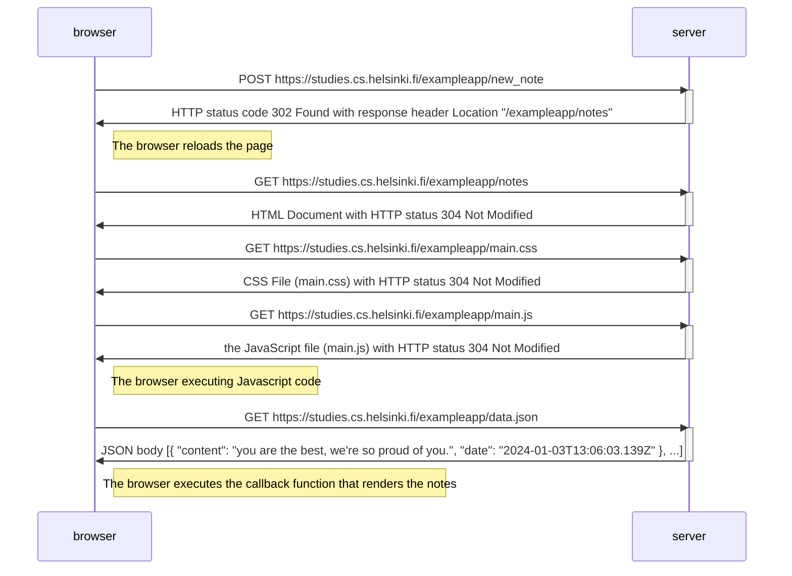

```mermaid

sequenceDiagram
    participant browser
    participant server

    browser->>server: POST https://studies.cs.helsinki.fi/exampleapp/new_note
    activate server

    server->>browser: HTTP status code 302 Found with response header Location "/exampleapp/notes"
    deactivate server


    Note right of browser: The browser reloads the page
    browser->>server: GET https://studies.cs.helsinki.fi/exampleapp/notes
    activate server

    server->>browser: HTML Document with HTTP status 304 Not Modified
    deactivate server


    browser->>server: GET https://studies.cs.helsinki.fi/exampleapp/main.css
    activate server

    server->>browser: CSS File (main.css) with HTTP status 304 Not Modified
    deactivate server


    browser->>server: GET https://studies.cs.helsinki.fi/exampleapp/main.js
    activate server

    server->>browser: the JavaScript file (main.js) with HTTP status 304 Not Modified
    deactivate server


    Note right of browser: The browser executing Javascript code
    browser->>server: GET https://studies.cs.helsinki.fi/exampleapp/data.json
    activate server

    server->>browser: JSON body [{ "content": "you are the best, we're so proud of you.", "date": "2024-01-03T13:06:03.139Z" }, ...]
    deactivate server

    Note right of browser: The browser executes the callback function that renders the notes

```
