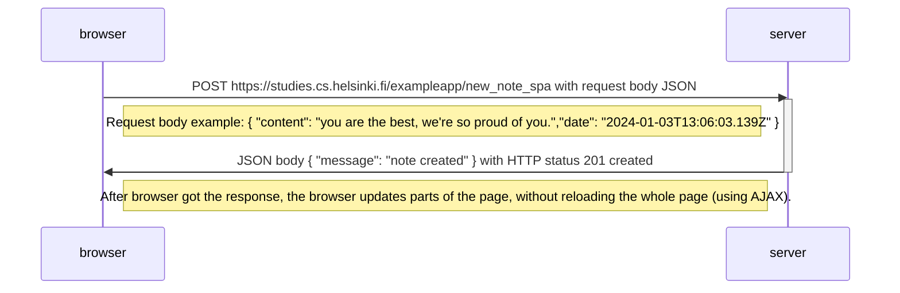

```mermaid

sequenceDiagram
    participant browser
    participant server

    browser->>server: POST https://studies.cs.helsinki.fi/exampleapp/new_note_spa with request body JSON
    activate server
    Note right of browser: Request body example: { "content": "you are the best, we're so proud of you.","date": "2024-01-03T13:06:03.139Z" }

    server->>browser: JSON body { "message": "note created" } with HTTP status 201 created
    deactivate server

    Note right of browser: After browser got the response, the browser updates parts of the page, without reloading the whole page (using AJAX).

```
